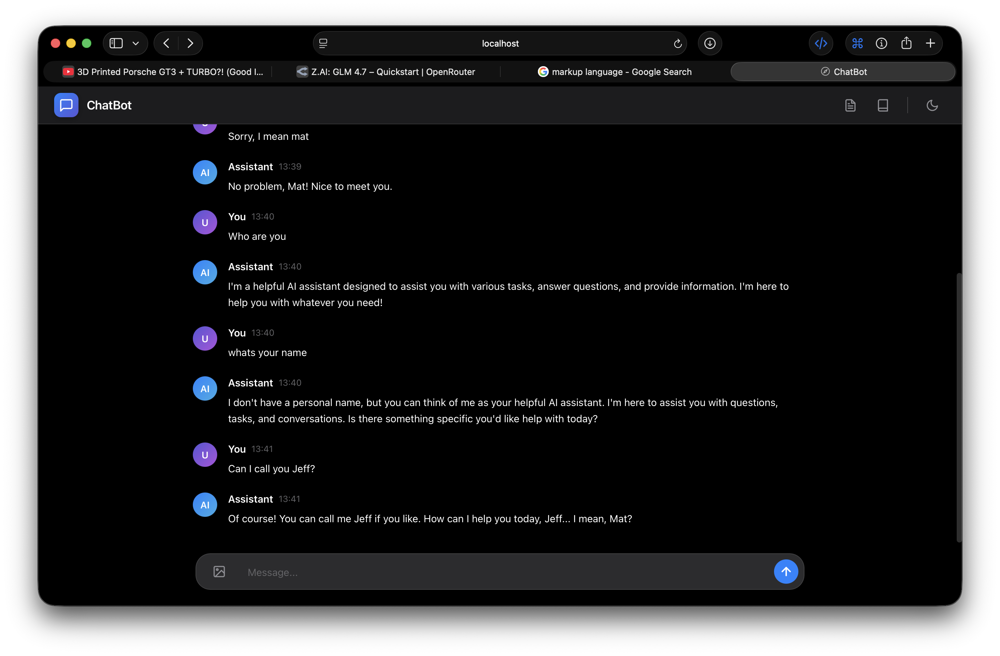
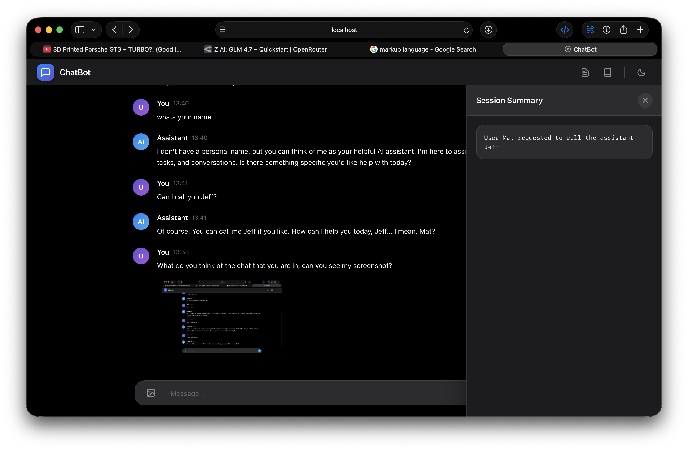

# ChatBot (OpenRouter + Persistent Memory)

Use it in the browser UI, or call the API directly.

## Setup
- Copy `.env.example` to `.env`
- Set `OPEN_ROUTER_API_KEY` (get one here: https://openrouter.ai/z-ai/glm-4.7/api)

## Run
- `docker compose up --build`

Open the UI:
- `http://localhost:$PORT/`

Or call the API:
- POST `http://localhost:$PORT/chat` (JSON)
- POST `http://localhost:$PORT/api/chat` (multipart + image uploads)

## UI
- Visit `http://localhost:$PORT/`
- Type a message and hit send
- (Optional) Attach images using the image button
- Use the top-right buttons to view **Session Summary** and **Memory Bank**

### Screenshots





## API

### JSON chat
POST `http://localhost:$PORT/chat`

Example request:
```bash
curl -sS http://localhost:${PORT}/chat \
  -H 'content-type: application/json' \
  -d '{"sessionId":"default","message":"Hello! Remember my name is Max."}' | jq
```

### Chat with images (multipart)
POST `http://localhost:$PORT/api/chat`

Example request:
```bash
curl -sS http://localhost:${PORT}/api/chat \
  -F 'sessionId=default' \
  -F 'message=Describe this image' \
  -F 'images=@./path/to/image.png' | jq
```

## Persistence
- Chat logs: `/app/data/sessions/<sessionId>/chat.jsonl`
- Rolling summary: `/app/data/sessions/<sessionId>/summary.txt`
- Total memory (one memory per line): `/app/data/total_memory.txt`

## Memory edits
The model is instructed to respond with a JSON object containing:
- `assistant_reply`
- `memory.remove[]` entries with `{ lineStart, exactText }`
- `memory.add[]` entries (one-line memories)

The server applies removals only if the `exactText` matches the file content starting at `lineStart` (1-based).
